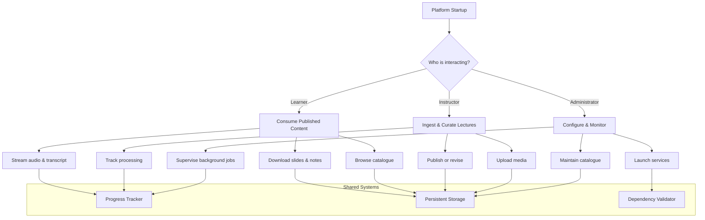
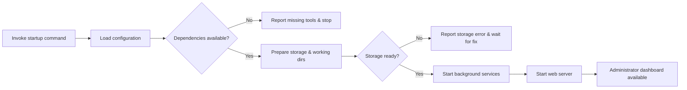
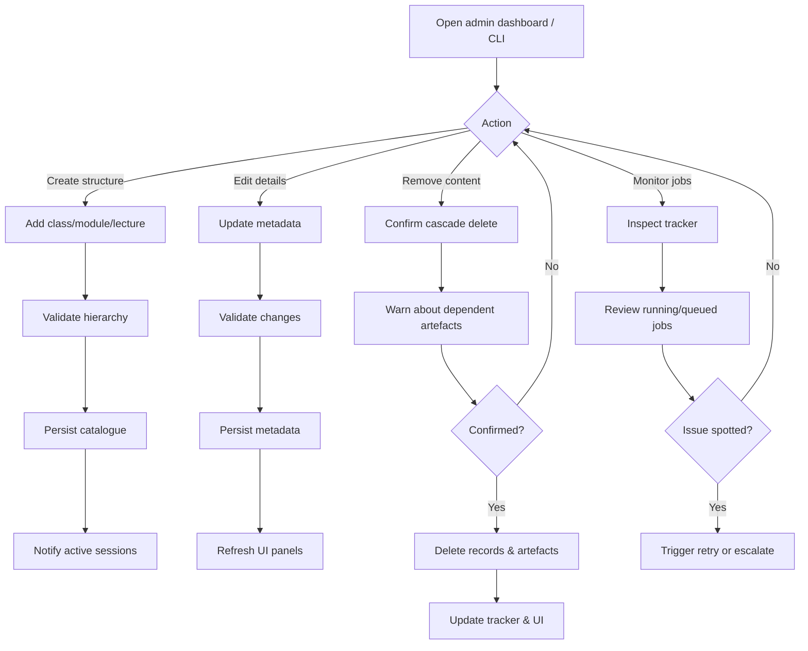
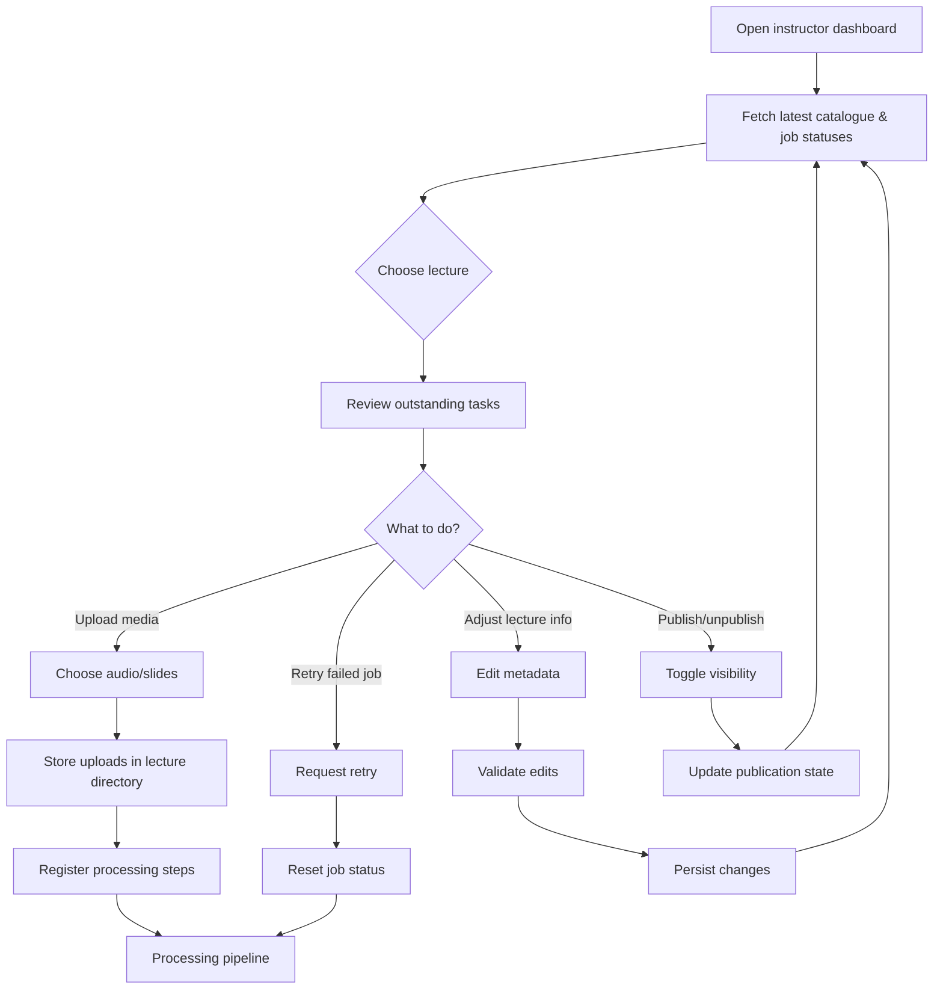
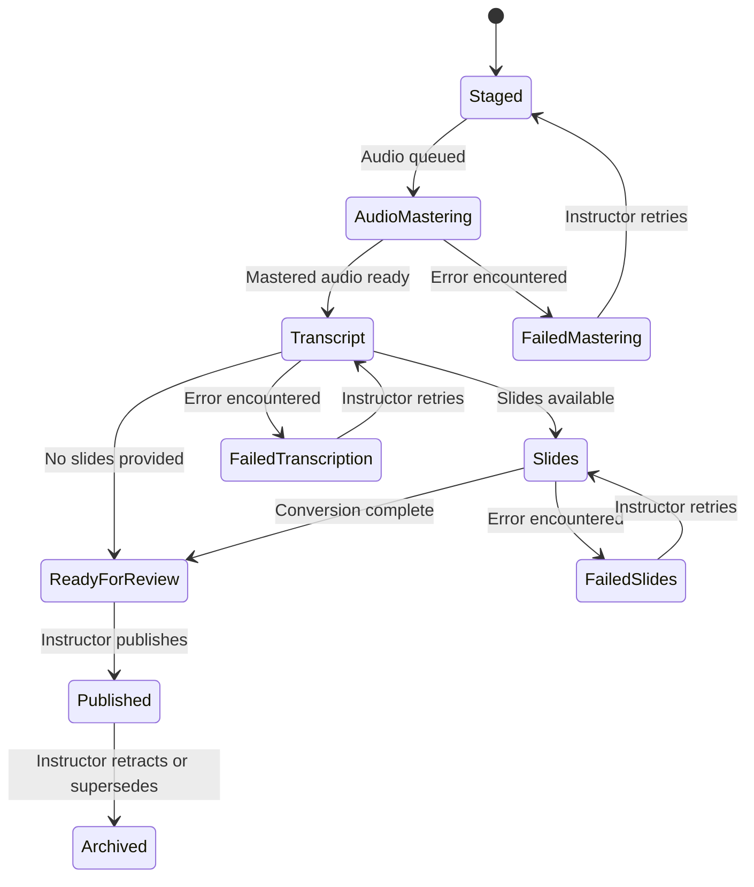
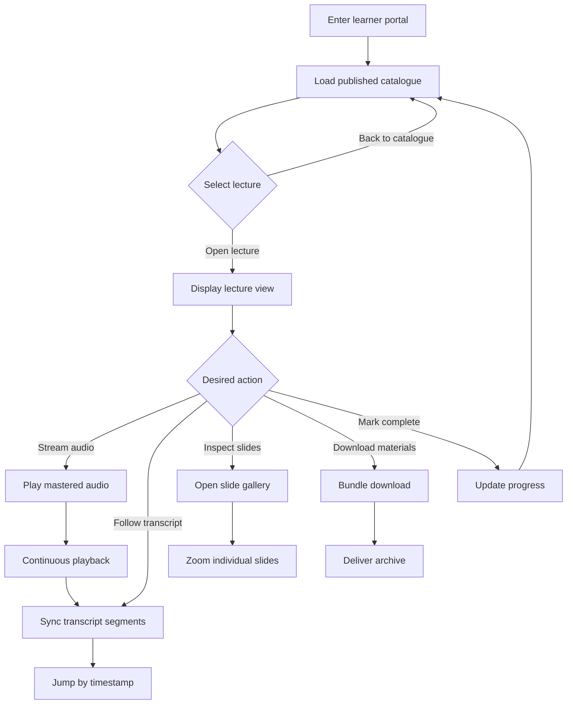
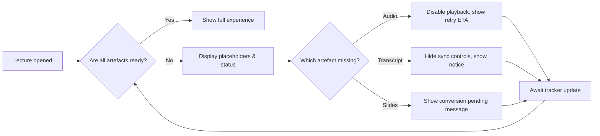
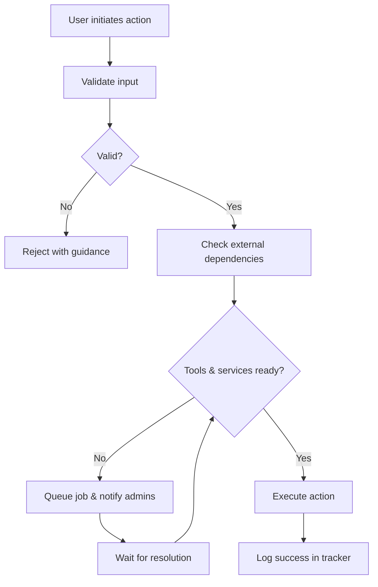

# Lecture Tools Logical Structure
This document visualises the observable behaviour of Lecture Tools. Each diagram focuses on the choices available to administrators, instructors, and learners, together with the resulting system reactions. No implementation details are described—only the logical steps that occur when a person interacts with the platform.

## 1. End-to-End Overview



The remainder of this document expands each branch so that every possible route a user can take is charted.

## 2. Administrator Journey

### 2.1 Bringing the platform online



### 2.2 Managing the catalogue and jobs



Administrators can loop through these options without restarting the platform. Every decision either updates storage immediately or guides the next corrective action.

## 3. Instructor Journey

### 3.1 Selecting ingestion paths



### 3.2 Processing pipeline reactions



When the **Slides** state transitions to **ReadyForReview**, the system stores a Markdown document containing the OCR results along with rendered slide images. The web experience offers a single ZIP download bundling both assets for students and instructors.

Every transition updates the unified progress tracker so that instructors immediately see where a lecture stands and what recovery options exist.

## 4. Learner Journey

### 4.1 Navigating the portal



### 4.2 Handling unavailable items



Learners continuously poll the tracker so that newly available media appears without reloading the page.

## 5. Cross-Cutting Safeguards

### 5.1 Validation and dependency checks



### 5.2 Error recovery loop

```mermaid
flowchart LR
    A[Failure reported] --> B[Show actionable message]
    B --> C{User role}
    C -->|Instructor| D[Retry from dashboard]
    C -->|Administrator| E[Resolve dependency/storage issue]
    C -->|Learner| F[Wait or switch lecture]
    D --> G[Job re-queued]
    E --> H[Fix environment]
    F --> I[Monitor tracker notifications]
    G --> J[Tracker updates all clients]
    H --> J
    I --> J
    J --> K{Problem solved?}
    K -->|Yes| L[Resume normal flow]
    K -->|No| B

